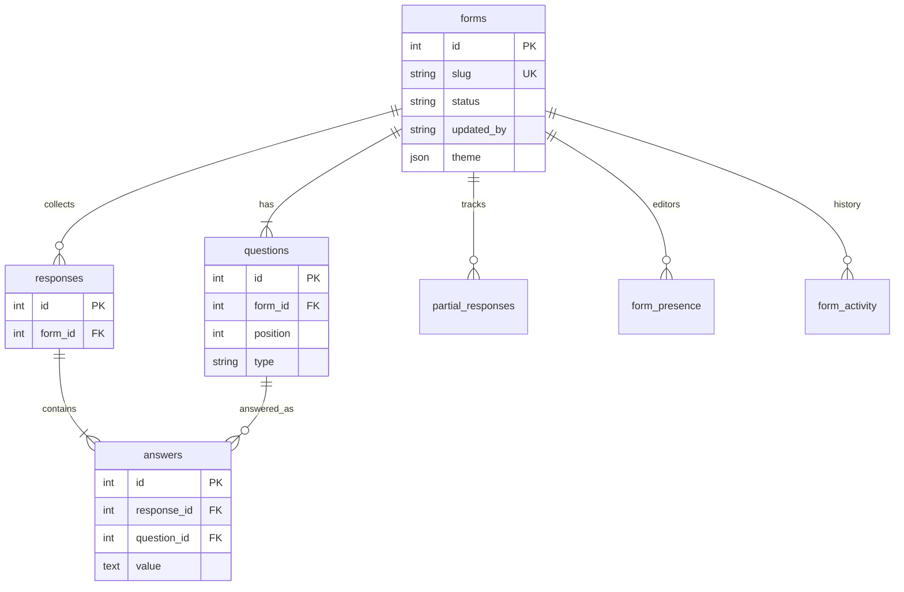

# Formly — Typeform-inspired full-stack form builder

**GitHub (public):** [https://github.com/ruthwikkakumani/formly](https://github.com/ruthwikkakumani/formly)

Formly clones Typeform’s workspace, builder, and conversational one-question-at-a-time fill flow. Creators build and publish forms; anyone with the link can respond without logging in. Results, themes, webhooks, team invites, live “who is editing”, save history, and bonus question types are included.

The repository contains `frontend/` and `backend/` as required by the assignment. Seeded published forms load on first API start so the app is usable immediately.

## Tech stack

- **Frontend:** Next.js 15, React 19, TypeScript
- **Backend:** FastAPI, SQLAlchemy 2, Pydantic
- **Database:** SQLite (`backend/typeform.db`)

## Run locally

See **[COMMANDS.md](./COMMANDS.md)** for copy-paste commands (local, GitHub, deploy).

```bash
cd backend && python3 -m venv .venv && source .venv/bin/activate
pip install -r requirements.txt && uvicorn main:app --reload --port 8000
```

```bash
cd frontend && npm install && npm run dev
```

Open http://localhost:3000 — API docs at http://localhost:8000/docs.

## Design docs (LLD + UML)

Full LLD, folder map, and diagrams live in **[`docs/`](./docs/README.md)** (Mermaid, renders on GitHub).

| Doc | Link |
|---|---|
| LLD | [docs/lld.md](./docs/lld.md) |
| Folder structure | [docs/folder-structure.md](./docs/folder-structure.md) |
| Use case | [docs/diagrams/use-case.md](./docs/diagrams/use-case.md) |
| Class / UML | [docs/diagrams/class-uml.md](./docs/diagrams/class-uml.md) |
| Sequence | [docs/diagrams/sequence.md](./docs/diagrams/sequence.md) |
| Activity | [docs/diagrams/activity.md](./docs/diagrams/activity.md) |
| State machines | [docs/diagrams/state.md](./docs/diagrams/state.md) |
| DB / ER schema | [docs/diagrams/db-schema.md](./docs/diagrams/db-schema.md) |
| Component + deploy | [docs/diagrams/component.md](./docs/diagrams/component.md) |

## Architecture

```
Page → View → Hook → lib/api → FastAPI route → Service → Repository → SQLite
```

Public fill (`/f/{slug}` and `/api/public/...`) never requires auth. Draft forms return 404 on the public API.

## Folder structure

```
formly/
├── docs/                 LLD + UML + sequence + ER
├── backend/
│   ├── main.py           app composition root
│   └── app/
│       ├── core/         config, constants
│       ├── db/           engine, session
│       ├── models/       Form, Question, Response, Answer, Partial, Member, Presence, Activity
│       ├── schemas/      Pydantic DTOs
│       ├── repositories/ SQL access
│       ├── services/     rules, validation, seed, webhooks, collaboration
│       └── api/routes/   forms, public, team, health, presence
└── frontend/
    ├── app/              thin routes: /, /builder/[id], /f/[slug], /team
    ├── components/       dashboard, builder, results, settings, respondent, team
    ├── hooks/            useForms, useBuilder, useRespondent, useCurrentUser
    ├── lib/              api, types, validation
    └── styles/           per-surface CSS
```

## Database schema



Saving a form updates questions by id so historical answers are kept. Full column list: [docs/diagrams/db-schema.md](./docs/diagrams/db-schema.md).

## API overview

- `GET/POST /api/forms` · `GET/PUT/PATCH/DELETE /api/forms/{id}`
- `POST /api/forms/{id}/duplicate` · `POST /api/forms/{id}/publish`
- `GET /api/forms/{id}/responses` · `GET /api/forms/{id}/stats` · `GET /api/forms/{id}/responses.csv`
- `POST/GET /api/forms/{id}/presence` · `GET /api/forms/{id}/activity`
- `GET /api/public/{slug}` · `POST /api/public/{slug}/responses|partial|upload`
- `GET/POST /api/workspace/members` · `DELETE /api/workspace/members/{id}`
- `GET /api/health`

## Features

Builder, CRUD, publish/share, conversational fill (keyboard + progress + validation), results + CSV, themes (colors, fonts, background, dark mode), thank-you copy, logic jumps, file upload, payments, webhooks, workspace collaboration, **live who-is-editing + save history**, seeded published forms.

## Assumptions

- Creators sign in with email/password. First register becomes owner; later people join only via invite accept. Public fill links stay open with no login.
- Payments record a successful pay action in the response (no live Stripe keys).
- Webhooks POST JSON on submit; a down endpoint does not fail the response.
- Team invites send a real email with an accept link. The person is added only after they accept; ignore/revoke leaves them out.
- Live collab uses presence heartbeats (not WebSockets). Identity is the signed-in account.

## Demo / deployment

1. Deploy `backend/` on Render (Docker + persistent disk for `typeform.db` / `uploads/`).
2. Set `CORS_ORIGINS` to your frontend origin, or rely on the default Vercel/Netlify regex.
3. Deploy `frontend/` on Vercel with:

```
NEXT_PUBLIC_API_URL=https://YOUR-API-HOST/api
```

Public fill (no login): `/f/product-feedback`

Step-by-step commands: [COMMANDS.md](./COMMANDS.md).

## Original work

Original implementation of the assignment. Not copied from another Typeform clone.
