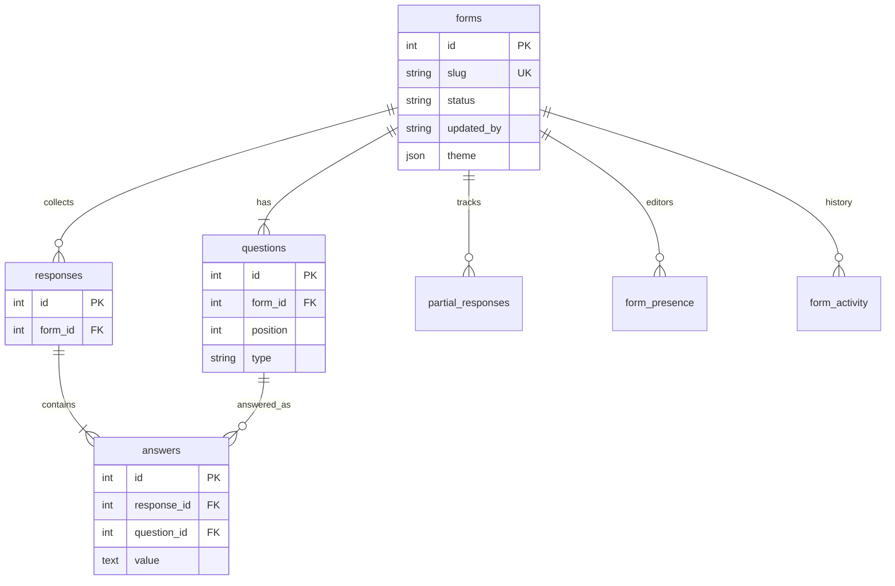

# Formly — Typeform-inspired full-stack form builder

**GitHub (public):** [https://github.com/ruthwikkakumani/formly](https://github.com/ruthwikkakumani/formly)

Formly clones Typeform’s workspace, builder, and conversational one-question-at-a-time fill flow. Creators build and publish forms; anyone with the link can respond without logging in.

The repository contains `frontend/` and `backend/` as required by the assignment. Seeded published forms load on first API start. A seeded **assignment reviewer** account (`reviewer@formly.dev` / `FormlyReview1`, role `editor`) is created if missing — not the owner, not a Gmail. The first person to register at `/register` becomes the workspace owner; later accounts join only by invite. Public fill (`/f/{slug}`) needs no login. `/login` shows the reviewer credentials for graders.

## Tech stack

- **Frontend:** Next.js 15, React 19, TypeScript
- **Backend:** FastAPI, SQLAlchemy 2, Pydantic
- **Database:** SQLite file created on boot. Local: `backend/typeform.db`. Railway: `/data/typeform.db` on a volume (`DATABASE_URL=sqlite:////data/typeform.db` — four slashes). The Docker image does **not** bake in a database.

## Run locally

See **[COMMANDS.md](./COMMANDS.md)** for copy-paste commands (local, GitHub, deploy).

```bash
cd backend && python3 -m venv .venv && source .venv/bin/activate
pip install -r requirements.txt && uvicorn main:app --reload --port 8000
```

```bash
cd frontend && npm install && npm run dev
```

Open http://localhost:3000 — API docs at http://localhost:8000/docs.

## Design docs (LLD + UML)

Full LLD, folder map, and diagrams live in **[`docs/`](./docs/README.md)** (Mermaid, renders on GitHub).

| Doc | Link |
|---|---|
| LLD | [docs/lld.md](./docs/lld.md) |
| Folder structure | [docs/folder-structure.md](./docs/folder-structure.md) |
| Use case | [docs/diagrams/use-case.md](./docs/diagrams/use-case.md) |
| Class / UML | [docs/diagrams/class-uml.md](./docs/diagrams/class-uml.md) |
| Sequence | [docs/diagrams/sequence.md](./docs/diagrams/sequence.md) |
| Activity | [docs/diagrams/activity.md](./docs/diagrams/activity.md) |
| State machines | [docs/diagrams/state.md](./docs/diagrams/state.md) |
| DB / ER schema | [docs/diagrams/db-schema.md](./docs/diagrams/db-schema.md) |
| Component + deploy | [docs/diagrams/component.md](./docs/diagrams/component.md) |

## Architecture

```
Page → View → Hook → lib/api → FastAPI route → Service → Repository → SQLite
```

Public fill (`/f/{slug}` and `/api/public/...`) never requires auth. Draft forms return 404 on the public API.

## Folder structure

```
formly/
├── docs/                 LLD + UML + sequence + ER
├── backend/
│   ├── main.py           app composition root
│   └── app/
│       ├── core/         config, constants, security, AppError
│       ├── db/           engine, session, SQLite column patches
│       ├── models/       Form, Question, Response, Answer, Partial, Member, Invite, Presence, Activity, PasswordReset
│       ├── schemas/      Pydantic DTOs
│       ├── repositories/ SQL access (forms, responses, members, invites, resets, collaboration)
│       ├── services/     rules, auth, invites, email, seed, webhooks, collaboration
│       └── api/routes/   auth, forms, public, team, invites, health
└── frontend/
    ├── app/              (workspace)/{page,team,settings}, /login, /register, /forgot-password, /reset/[token], /invite/[token], /builder/[id], /f/[slug]
    ├── components/       dashboard (incl. templates), builder, results, settings, respondent, team
    ├── hooks/            useForms, useBuilder, useRespondent, useCurrentUser
    ├── lib/              api, types, validation, templates, errors, access, fillDraft
    └── styles/           per-surface CSS
```

## Database schema



Saving a form updates questions by id so historical answers are kept. Full column list: [docs/diagrams/db-schema.md](./docs/diagrams/db-schema.md).

## API overview

- `GET/POST /api/forms` · `GET/PUT/PATCH/DELETE /api/forms/{id}`
- `POST /api/forms/{id}/duplicate` · `POST /api/forms/{id}/publish`
- `GET /api/forms/{id}/responses` · `GET /api/forms/{id}/stats` · `GET /api/forms/{id}/results` · `GET /api/forms/{id}/responses.csv`
- `POST/GET/DELETE /api/forms/{id}/presence` · `GET /api/forms/{id}/activity`
- `GET /api/public/{slug}` · `GET/POST /api/public/{slug}/partial` · `POST /api/public/{slug}/responses|upload`
- `POST /api/auth/register` · `POST /api/auth/login` · `GET/PATCH /api/auth/me` · `POST /api/auth/password`
- `POST /api/auth/forgot-password` · `GET/POST /api/auth/reset-password/{token}`
- `GET /api/workspace/members` · `DELETE /api/workspace/members/{id}` (remove: owner only)
- `GET/POST /api/workspace/invites` · `DELETE /api/workspace/invites/{id}` (owner only)
- `GET /api/invites/{token}` · `POST /api/invites/{token}/accept`
- `GET /api/health`

## Features

Builder, CRUD, publish/share, conversational fill (keyboard + progress + validation + resume after refresh), results + CSV, themes (colors, fonts, background, fill dark mode), thank-you copy, logic jumps, file upload, payment stub, webhooks, workspace collaboration, who-is-editing + save history, starter **templates** (6), seeded published forms.

**Auth.** First `/register` creates the owner (a seeded reviewer editor does not block that). After that, new people join only by accepting an invite. Public `/f/{slug}` stays open with no login. Forgot password is `/forgot-password`; the emailed link opens `/reset/{token}`.

**Reviewer login.** Graders sign in at `/login`. Demo accounts are seeded from env (`OWNER_*`, `REVIEWER_*`, `VIEWER_*`) and listed on the page via `GET /api/auth/demo` — they are not hardcoded in the frontend. Default reviewer: `reviewer@formly.dev` / `FormlyReview1` (editor).

**Roles.** `owner` — full access including invites and role changes. `editor` — create/edit/publish forms; no team admin. `viewer` — read-only on forms (list, builder, results). The owner can switch a teammate between viewer and editor.

**Invites.** Owner sends an email from Workspace (`/team`) or Settings (`/settings`) and always gets a **copy link**. On Railway, Gmail SMTP (ports 587/465) is often blocked, so the email may not arrive — the invite is still created and the copy link works.

**Password reset.** Same SMTP path as invites. The reset token is always created. Locally (`FRONTEND_URL` on localhost) the page also shows a copy link; on Railway the email may not arrive, and the UI still returns a professional message (it does not leak whether the address exists).

**Workspace Settings.** Shell **Settings** opens `/settings`: change account name/password, plus the team list (invite UI for the owner). Form description in the builder Settings tab is a textarea.

**Presence.** Other signed-in members appear in the builder. Leaving the page (unmount / `pagehide`) clears presence. This is not OT/CRDT or Google Docs live typing: you save, then other open builders poll and reload if their draft is clean.

**Builder list.** Questions reorder with `@dnd-kit`. Dragging a row over another **slides neighbors to open a gap**; drop commits the new order; Escape cancels. Overlay follows the pointer; axis is vertical only.

**Public fill.** One question at a time, centered Typeform layout (Fraunces titles, underline answers, no focus box). Answers and position save to `localStorage` immediately and to `POST /api/public/{slug}/partial` in the background. A refresh or new visit with the same browser resumes where the respondent stopped (`GET /partial` + `lib/fillDraft.ts`). After a successful submit, that tab shows thank-you; a later visit can start a new response.

**Results.** Combined `GET /forms/{id}/results` (polls while the Results tab is open). Insight cards (`QuestionInsight`): **donut** + legend for multiple choice / dropdown / yes-no, **rating** columns (1–5) with average, snippets for open text. Completion % + in-progress count from partials. Wrapping-header response table with a **sticky Submitted** column, row detail modal, and Export CSV.

**Errors.** API and UI messages are situation-specific (auth, invites, publish, network, SMTP blocked). Hung requests abort after 8 seconds instead of spinning forever.

Public fill has no “Powered by formly” footer.

## Assignment scope

**Required:** `frontend/` + `backend/`, workspace + builder, publish + shareable public fill, conversational one-question flow, results.

**Beyond the brief:** JWT auth (owner + invite-only teammates), email invites with copy-link fallback, forgot-password reset, workspace Settings, live presence, save history, starter templates, professional errors, and the extra question types / themes / webhooks / logic jumps that make the product feel complete.

## Assumptions

- Creators sign in with email/password. First register becomes owner; later people join only via invite accept. Public fill links stay open with no login.
- Assignment reviewers use the seeded `reviewer@formly.dev` / `FormlyReview1` editor shown on `/login` — not a personal Gmail.
- `editor` can create, edit, and publish forms. `viewer` is read-only until the owner promotes them. Only the owner invites, removes, or changes roles.
- Payments record a successful pay action in the response (no live Stripe keys).
- Public fill progress is stored per slug in `localStorage` (visitor id + answers + question index) and mirrored to `partial_responses`. A refresh restores the same session.
- Webhooks POST JSON on submit; a down endpoint does not fail the response.
- Team invites send a real email with an accept link when SMTP is reachable. The person is added only after they accept; ignore/revoke leaves them out. Copy link is the reliable fallback.
- Presence uses heartbeats (not WebSockets, OT, or CRDT). Identity is the signed-in account. Other builders see who is there and pick up **saved** changes — not character-by-character typing.

## Demo / deployment

Live demo: [https://formly.rdrt.dev](https://formly.rdrt.dev) · API: [https://formly-api.rdrt.dev/docs](https://formly-api.rdrt.dev/docs)

Docker Hub: `ruthwikkakumani/formly-frontend:{latest,1.0}` and `ruthwikkakumani/formly-backend:{latest,1.0}`. Images do not auto-update on Railway unless you Redeploy (no Watchtower).

1. Railway: two services from those images. Mount a **volume at `/data`** on the backend (SQLite + uploads).
2. Backend env (no quotes around values):
   - `DATABASE_URL=sqlite:////data/typeform.db` (four slashes)
   - `UPLOAD_DIR=/data/uploads`
   - `CORS_ORIGINS=https://formly.rdrt.dev`
   - `FRONTEND_URL=https://formly.rdrt.dev`
   - `AUTH_SECRET=...` plus SMTP or Resend for invite mail
3. Frontend env: `NEXT_PUBLIC_API_URL=https://formly-api.rdrt.dev/api`

Public fill (no login): `/f/product-feedback`  
Reviewer sign-in: `/login` → `reviewer@formly.dev` / `FormlyReview1`  
Create owner: `/register`

Step-by-step: [COMMANDS.md](./COMMANDS.md).

## Original work

Original implementation of the assignment. Not copied from another Typeform clone.
