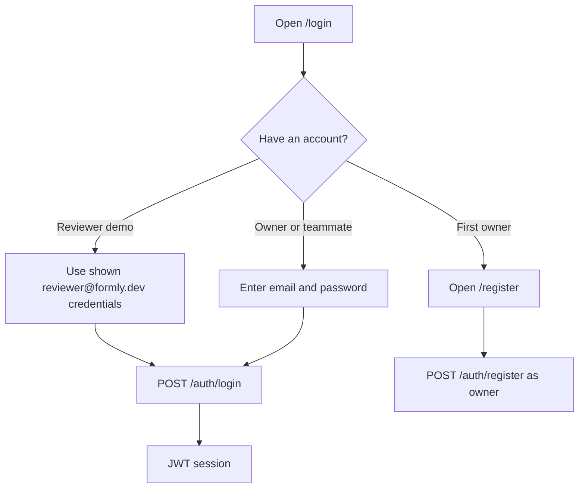
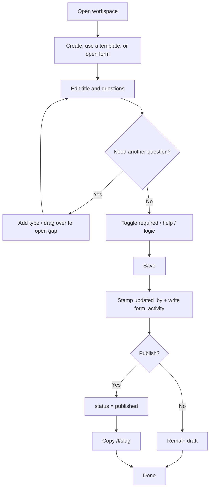
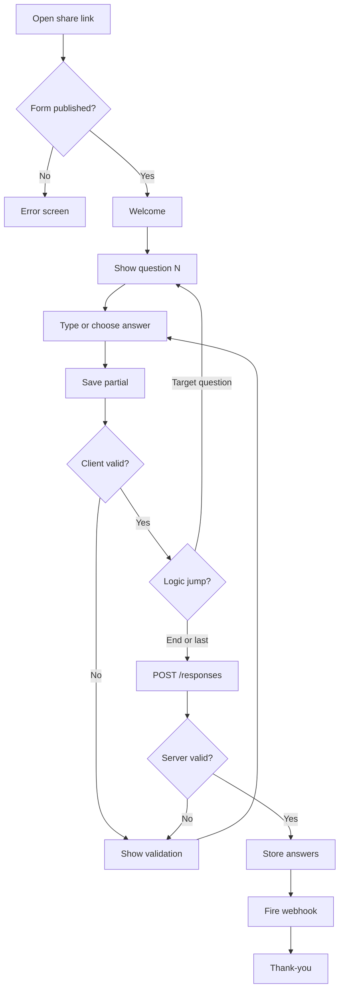
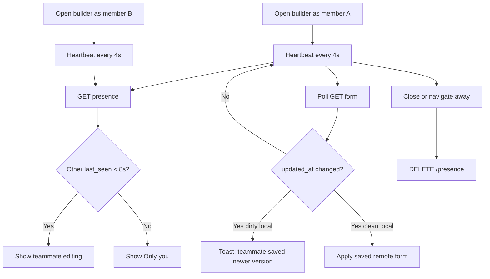
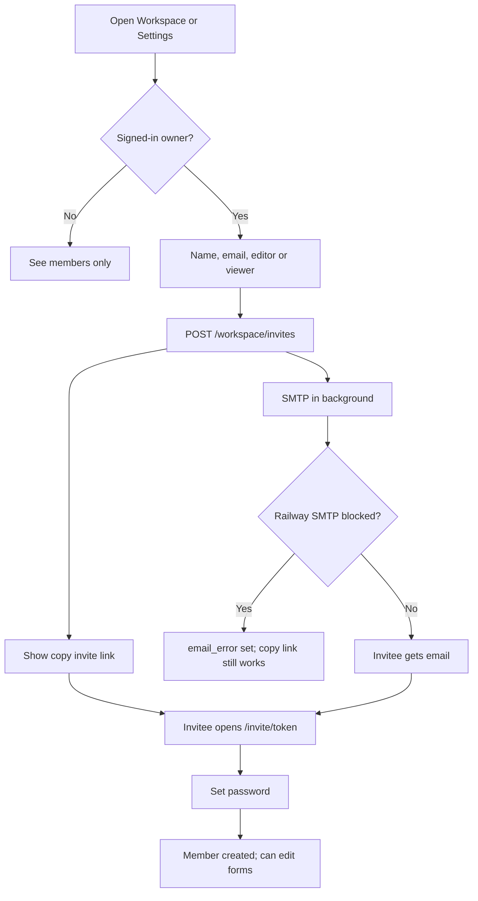
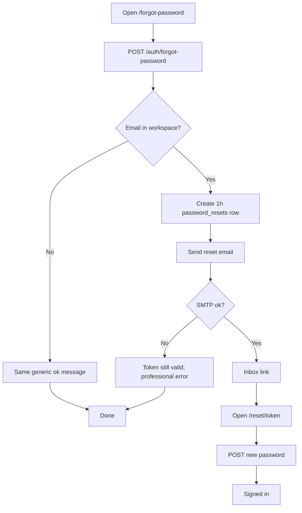

# Activity diagrams

## Sign in (including assignment reviewer)

## Creator: build and publish

## Respondent: one question at a time

## Two teammates editing the same form

## Owner invites a teammate

## Forgot password

