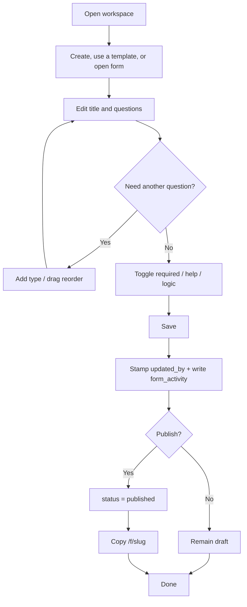
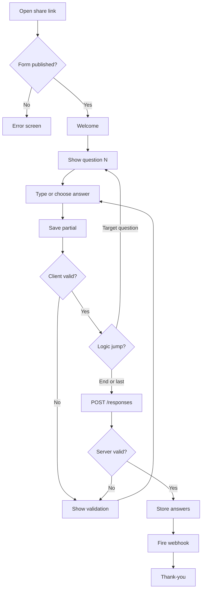

# Activity diagrams

## Creator: build and publish



## Respondent: one question at a time



## Two teammates editing the same form

```mermaid
flowchart TD
  A[Open builder as member A] --> B[Heartbeat every 4s]
  C[Open builder as member B] --> D[Heartbeat every 4s]
  B --> E[GET presence]
  D --> E
  E --> F{Other last_seen < 8s?}
  F -->|Yes| G[Show "X editing"]
  F -->|No| H[Show Only you]
  B --> I[Poll GET form]
  I --> J{updated_at changed?}
  J -->|No| B
  J -->|Yes dirty local| K[Toast: teammate saved newer version]
  J -->|Yes clean local| L[Apply saved remote form]
  B --> M[Close or navigate away]
  M --> N[DELETE /presence]
```
