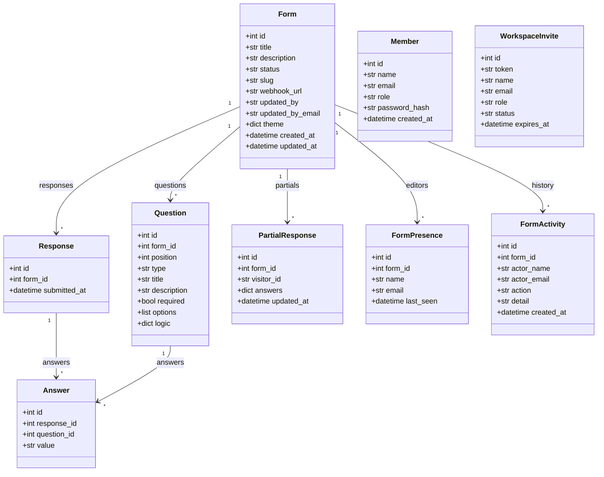
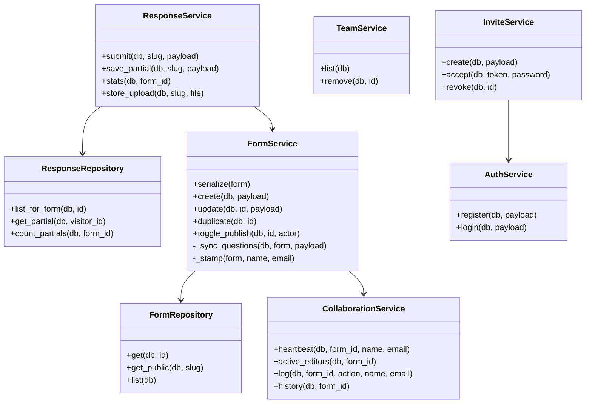
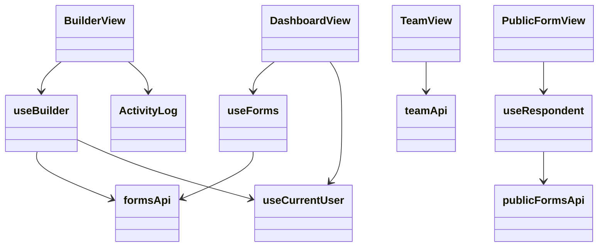

# Class / UML diagram

## Domain (SQLAlchemy)

```mermaid
classDiagram
  class Form {
    +int id
    +str title
    +str description
    +str status
    +str slug
    +str webhook_url
    +str updated_by
    +str updated_by_email
    +dict theme
    +datetime created_at
    +datetime updated_at
  }
  class Question {
    +int id
    +int form_id
    +int position
    +str type
    +str title
    +str description
    +bool required
    +list options
    +dict logic
  }
  class Response {
    +int id
    +int form_id
    +datetime submitted_at
  }
  class Answer {
    +int id
    +int response_id
    +int question_id
    +str value
  }
  class PartialResponse {
    +int id
    +int form_id
    +str visitor_id
    +dict answers
    +datetime updated_at
  }
  class Member {
    +int id
    +str name
    +str email
    +str role
    +str password_hash
    +datetime created_at
  }
  class WorkspaceInvite {
    +int id
    +str token
    +str name
    +str email
    +str role
    +str status
    +datetime expires_at
  }
  class FormPresence {
    +int id
    +int form_id
    +str name
    +str email
    +datetime last_seen
  }
  class FormActivity {
    +int id
    +int form_id
    +str actor_name
    +str actor_email
    +str action
    +str detail
    +datetime created_at
  }
  Form "1" --> "*" Question : questions
  Form "1" --> "*" Response : responses
  Form "1" --> "*" PartialResponse : partials
  Form "1" --> "*" FormPresence : editors
  Form "1" --> "*" FormActivity : history
  Response "1" --> "*" Answer : answers
  Question "1" --> "*" Answer : answers
```

## Application services

```mermaid
classDiagram
  class FormRepository {
    +get(db, id)
    +get_public(db, slug)
    +list(db)
  }
  class ResponseRepository {
    +list_for_form(db, id)
    +get_partial(db, visitor_id)
    +count_partials(db, form_id)
  }
  class FormService {
    +serialize(form)
    +create(db, payload)
    +update(db, id, payload)
    +duplicate(db, id)
    +toggle_publish(db, id, actor)
    -_sync_questions(db, form, payload)
    -_stamp(form, name, email)
  }
  class CollaborationService {
    +heartbeat(db, form_id, name, email)
    +active_editors(db, form_id)
    +log(db, form_id, action, name, email)
    +history(db, form_id)
  }
  class ResponseService {
    +submit(db, slug, payload)
    +save_partial(db, slug, payload)
    +stats(db, form_id)
    +store_upload(db, slug, file)
  }
  class TeamService {
    +list(db)
    +remove(db, id)
  }
  class AuthService {
    +register(db, payload)
    +login(db, payload)
  }
  class InviteService {
    +create(db, payload)
    +accept(db, token, password)
    +revoke(db, id)
  }
  FormService --> FormRepository
  FormService --> CollaborationService
  ResponseService --> FormService
  ResponseService --> ResponseRepository
  InviteService --> AuthService
```

## Frontend (React)

```mermaid
classDiagram
  class DashboardView
  class BuilderView
  class PublicFormView
  class TeamView
  class ActivityLog
  class useForms
  class useBuilder
  class useRespondent
  class useCurrentUser
  class formsApi
  class publicFormsApi
  class teamApi
  DashboardView --> useForms
  DashboardView --> useCurrentUser
  BuilderView --> useBuilder
  BuilderView --> ActivityLog
  PublicFormView --> useRespondent
  TeamView --> teamApi
  useForms --> formsApi
  useBuilder --> formsApi
  useBuilder --> useCurrentUser
  useRespondent --> publicFormsApi
```
