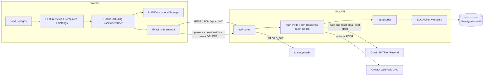
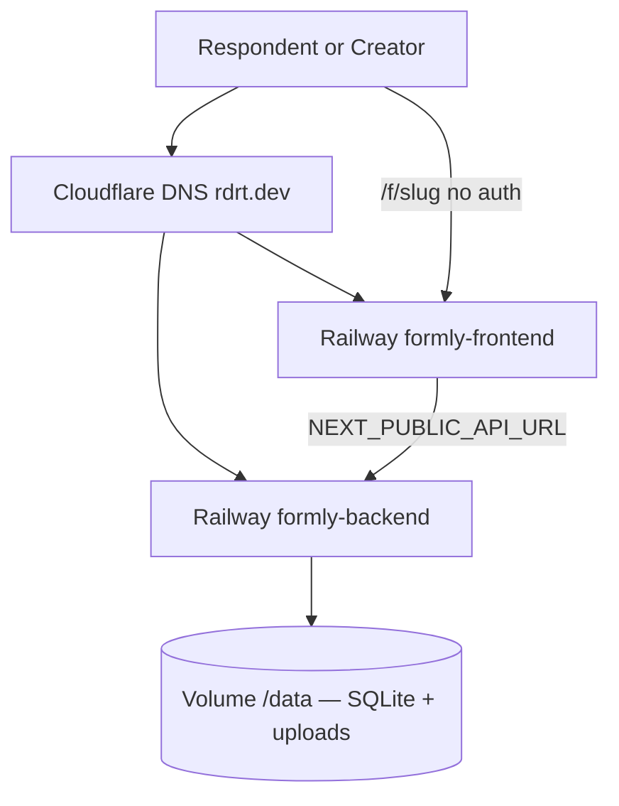

# Component and deployment diagrams

## Component diagram

Invite email is best-effort. If Railway cannot reach SMTP (ports 587/465 often blocked), the invite row still exists and the owner copies the accept link. Password reset uses the same SMTP; the token is created even when mail fails.

## Deployment

Images: `ruthwikkakumani/formly-frontend:{latest,1.0}` and `ruthwikkakumani/formly-backend:{latest,1.0}` (linux/amd64 + linux/arm64). After a registry push, Redeploy both Railway services (no Watchtower).

Live: [https://formly.rdrt.dev](https://formly.rdrt.dev) · API [https://formly-api.rdrt.dev](https://formly-api.rdrt.dev)

Two Railway services. Backend volume mount **`/data`**.

| Variable | Value |
|---|---|
| `DATABASE_URL` | `sqlite:////data/typeform.db` (four slashes) |
| `UPLOAD_DIR` | `/data/uploads` |
| `CORS_ORIGINS` | `https://formly.rdrt.dev` — no quotes |
| `FRONTEND_URL` | `https://formly.rdrt.dev` |
| `NEXT_PUBLIC_API_URL` | `https://formly-api.rdrt.dev/api` |
| `REVIEWER_EMAIL` / `REVIEWER_PASSWORD` | defaults `reviewer@formly.dev` / `FormlyReview1` (seeded editor) |
| `NEXT_PUBLIC_REVIEWER_EMAIL` / `NEXT_PUBLIC_REVIEWER_PASSWORD` | same defaults, shown on `/login` |

CORS also allows localhost, `*.up.railway.app`, and `*.rdrt.dev`.
