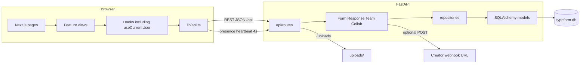
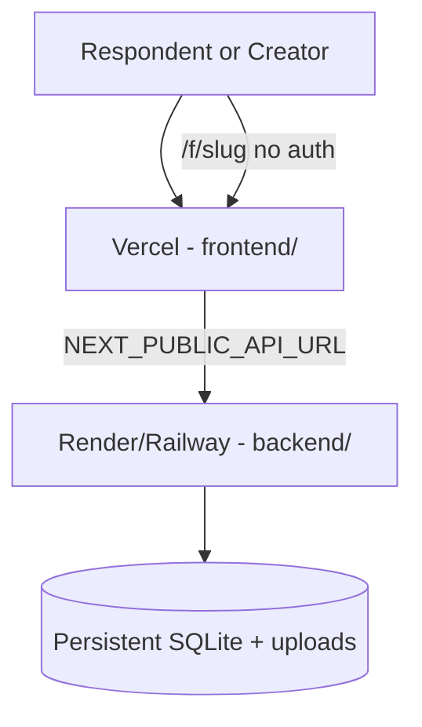

# Component and deployment diagrams

## Component diagram

```mermaid
flowchart LR
  subgraph Browser
    Pages[Next.js pages]
    Views[Feature views]
    Hooks[Hooks including useCurrentUser]
    Client[lib/api.ts]
    Pages --> Views --> Hooks --> Client
  end

  subgraph FastAPI
    Routes[api/routes]
    Services[Form Response Team Collab]
    Repos[repositories]
    Models[SQLAlchemy models]
    Routes --> Services --> Repos --> Models
  end

  Client -->|REST JSON /api| Routes
  Client -->|presence heartbeat 4s| Routes
  Models --> SQLite[(typeform.db)]
  Services -->|optional POST| Webhook[Creator webhook URL]
  Routes -->|/uploads| Disk[uploads/]
```

## Deployment

```mermaid
flowchart TB
  User[Respondent or Creator]
  Vercel[Vercel - frontend/]
  Render[Render/Railway - backend/]
  Disk[(Persistent SQLite + uploads)]

  User --> Vercel
  Vercel -->|NEXT_PUBLIC_API_URL| Render
  User -->|/f/slug no auth| Vercel
  Render --> Disk
```

CORS allows localhost plus `*.vercel.app` / `*.netlify.app` / `*.onrender.com`.
