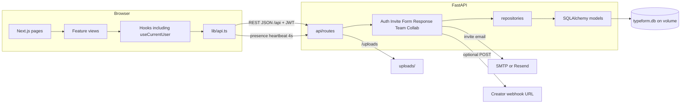
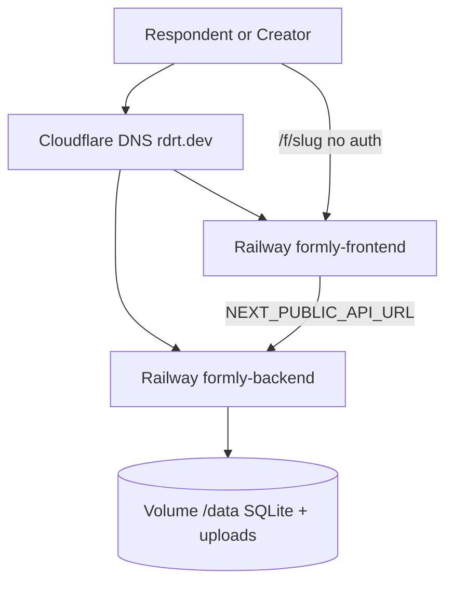

# Component and deployment diagrams

## Component diagram

## Deployment

Images: `ruthwikkakumani/formly-frontend` and `ruthwikkakumani/formly-backend`.  
CORS allows localhost, `*.up.railway.app`, and `*.rdrt.dev`.
