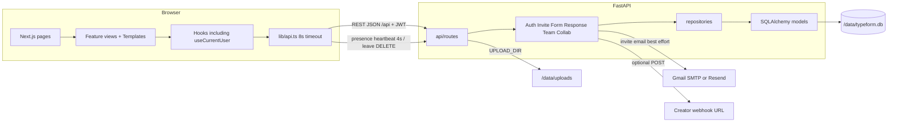
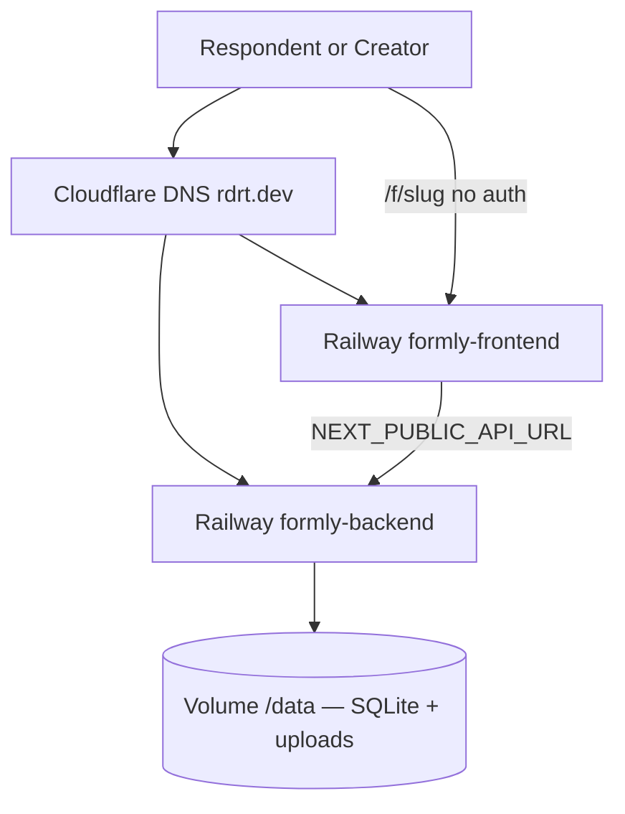

# Component and deployment diagrams

## Component diagram

Invite email is best-effort. If Railway cannot reach SMTP (ports 587/465 often blocked), the invite row still exists and the creator copies the accept link.

## Deployment

Images: `ruthwikkakumani/formly-frontend` and `ruthwikkakumani/formly-backend`.

Live: [https://formly.rdrt.dev](https://formly.rdrt.dev) · API [https://formly-api.rdrt.dev](https://formly-api.rdrt.dev)

Two Railway services. Backend volume mount **`/data`**.

| Variable | Value |
|---|---|
| `DATABASE_URL` | `sqlite:////data/typeform.db` (four slashes) |
| `UPLOAD_DIR` | `/data/uploads` |
| `CORS_ORIGINS` | `https://formly.rdrt.dev` — no quotes |
| `FRONTEND_URL` | `https://formly.rdrt.dev` |
| `NEXT_PUBLIC_API_URL` | `https://formly-api.rdrt.dev/api` |

CORS also allows localhost, `*.up.railway.app`, and `*.rdrt.dev`.
