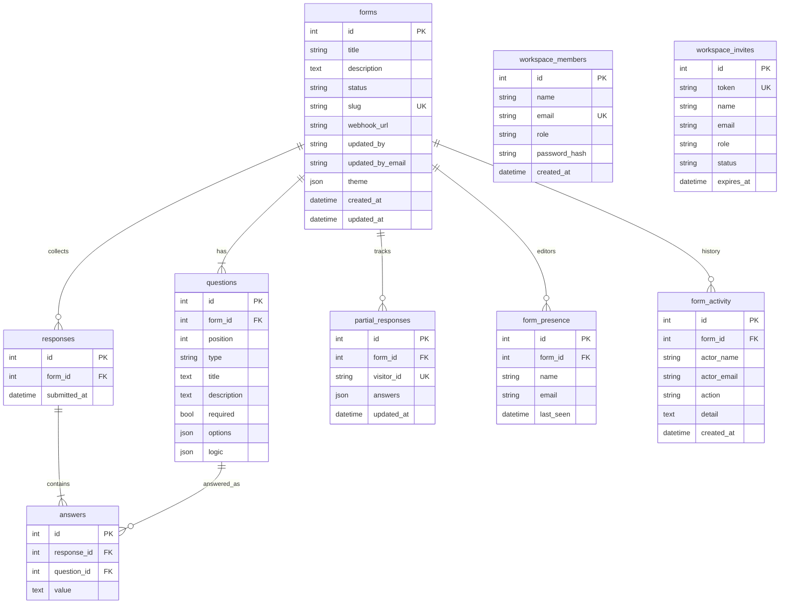

# Database schema (ER)

SQLite file created on boot (local `backend/typeform.db`, production `/data/typeform.db`). Not baked into the Docker image.

## Constraints and rules

| Rule | Why |
|---|---|
| `forms.slug` unique + indexed | public URL `/f/{slug}` |
| `forms.status` in `{draft, published}` | unpublished forms 404 on public API |
| `forms.updated_by` | last person who saved / published / renamed |
| `questions.position` ordered | builder + respondent order |
| `questions.options` JSON | MC / dropdown / payment amount+currency |
| `questions.logic` JSON | `{ rules: [{ option, target_id, end }] }` |
| `forms.theme` JSON | colors, font, thankYou, darkMode |
| `partial_responses.visitor_id` unique | one in-progress blob per browser |
| `form_presence (form_id, email)` unique | one live editor row per person per form |
| `form_presence.last_seen` | drop from UI if older than 20 seconds |
| `form_activity.action` | `created`, `saved`, `renamed`, `published`, `draft`, `duplicated` |
| ON DELETE CASCADE from form | deleting a form wipes children including presence/activity |
| Question update by id | saving the builder does not orphan historical answers |

## Indexes

- `forms.slug`
- `questions.form_id`
- `responses.form_id`
- `answers.response_id`, `answers.question_id`
- `partial_responses.form_id`, `partial_responses.visitor_id`
- `workspace_members.email`
- `form_presence.form_id`, `form_presence.email`
- `form_activity.form_id`
