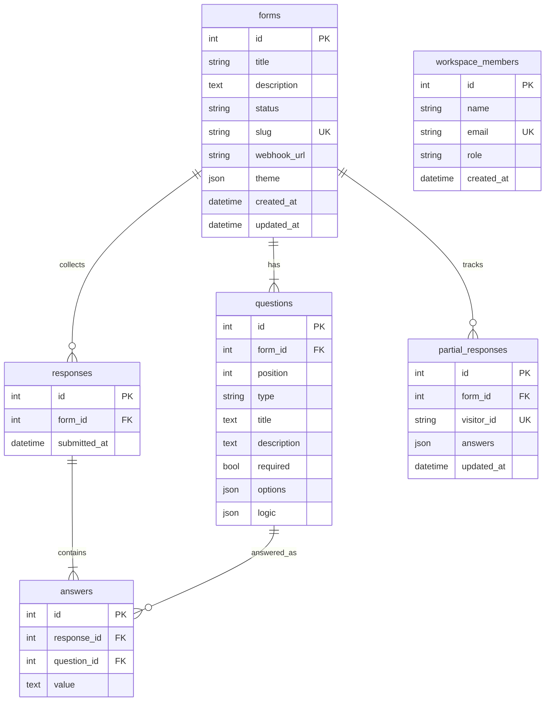

# Database schema (ER)

SQLite file: `backend/typeform.db`. Designed for this product (not copied from Typeform).

## Constraints and rules

| Rule | Why |
|---|---|
| `forms.slug` unique + indexed | public URL `/f/{slug}` |
| `forms.status` in `{draft, published}` | unpublished forms 404 on public API |
| `questions.position` ordered | builder + respondent order |
| `questions.options` JSON | MC / dropdown / payment amount+currency |
| `questions.logic` JSON | `{ rules: [{ option, target_id, end }] }` |
| `forms.theme` JSON | colors, font, thankYou, darkMode |
| `partial_responses.visitor_id` unique | one in-progress blob per browser |
| ON DELETE CASCADE from form | deleting a form wipes children |
| Question update by id | saving the builder does not orphan historical answers |

## Indexes

- `forms.slug`
- `questions.form_id`
- `responses.form_id`
- `answers.response_id`, `answers.question_id`
- `partial_responses.form_id`, `partial_responses.visitor_id`
- `workspace_members.email`
