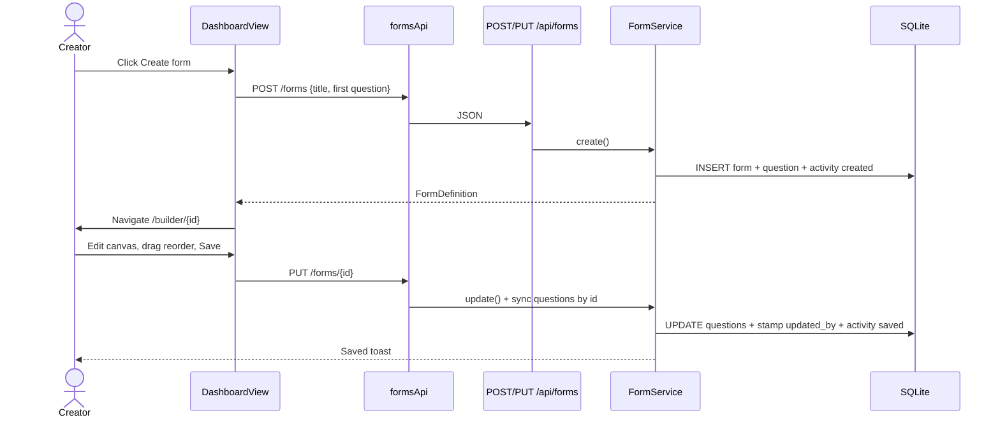
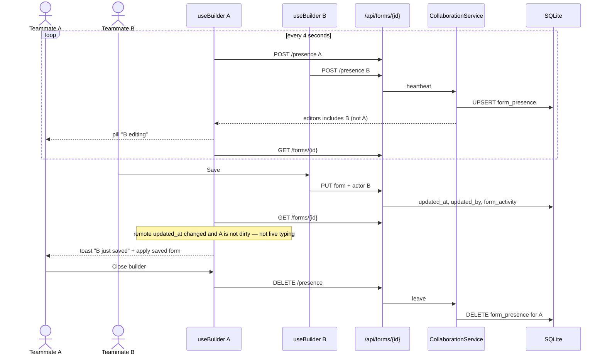
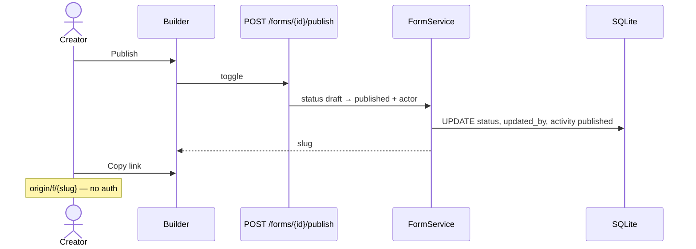
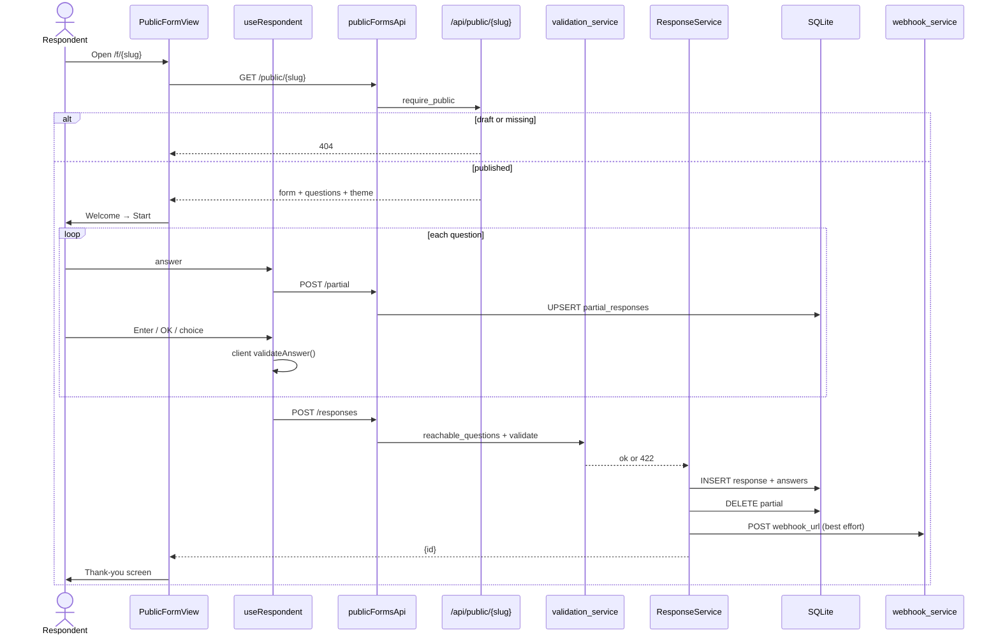
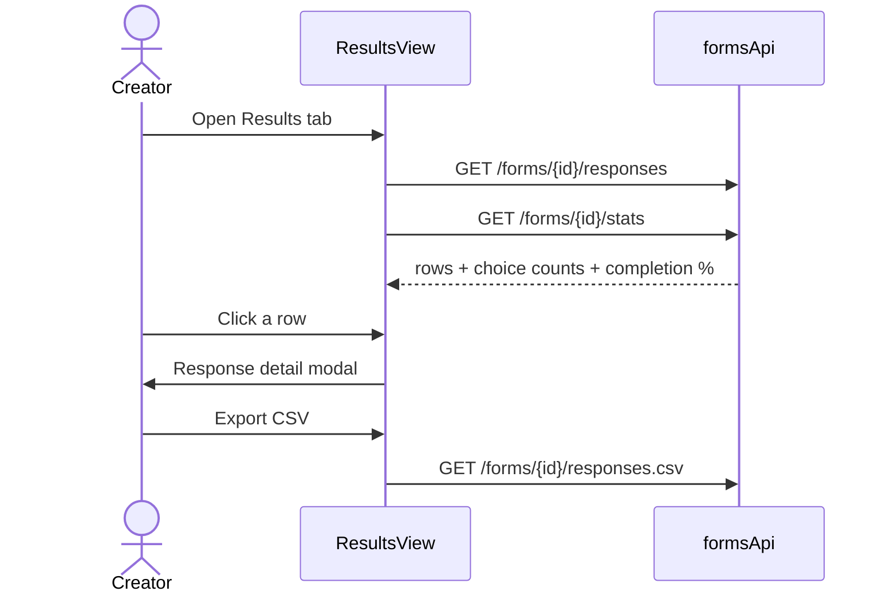
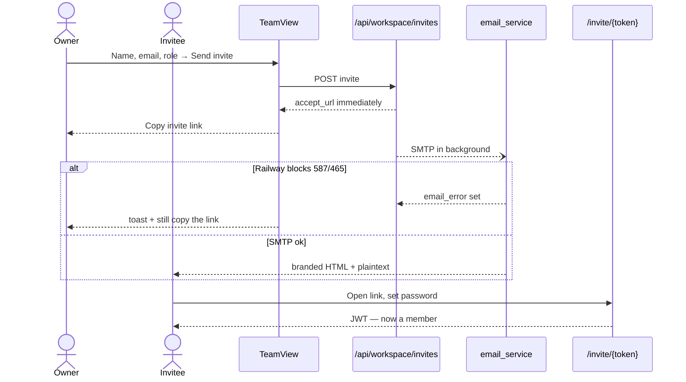

# Sequence diagrams

## 1. Create + build + save

## 1b. Live editors + live save sync

## 2. Publish and share

## 3. Respondent fill + submit (no login)

## 4. Results

## 5. Invite teammate (email + copy link)

