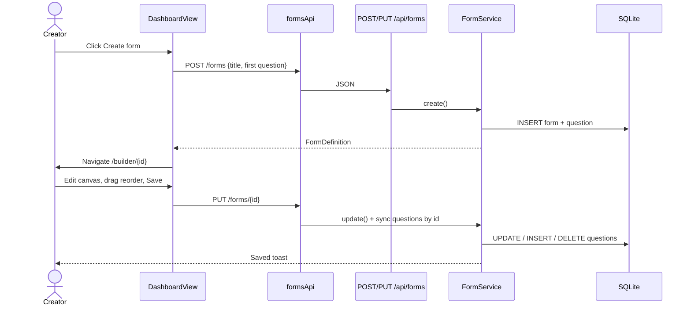
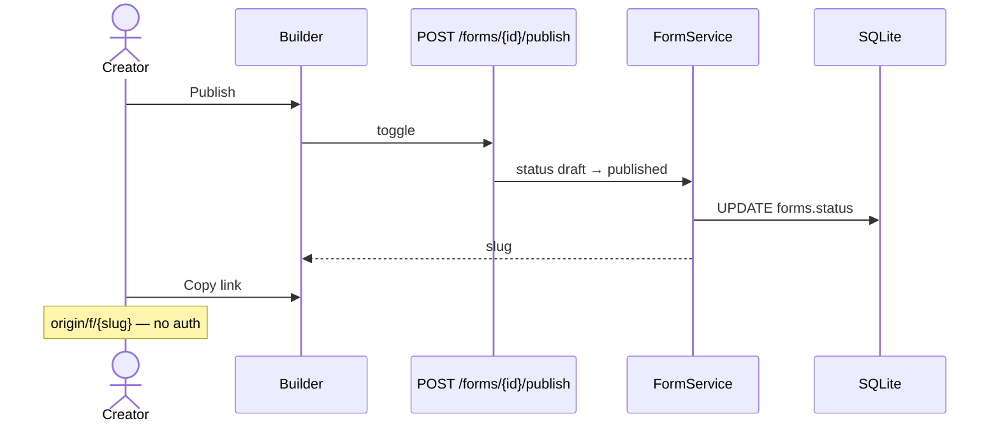
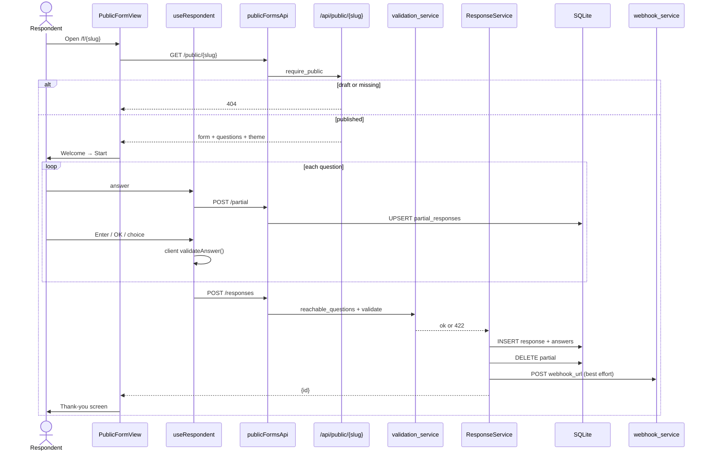
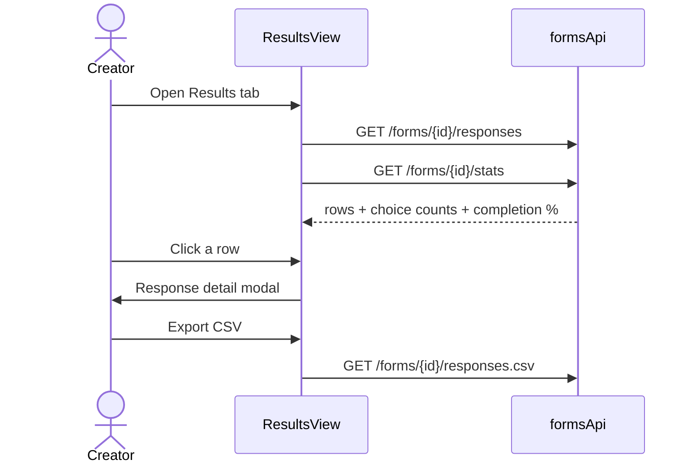

# Sequence diagrams

## 1. Create + build + save

```mermaid
sequenceDiagram
  actor Creator
  participant Dash as DashboardView
  participant API as formsApi
  participant Route as POST/PUT /api/forms
  participant Svc as FormService
  participant DB as SQLite

  Creator->>Dash: Click Create form
  Dash->>API: POST /forms {title, first question}
  API->>Route: JSON
  Route->>Svc: create()
  Svc->>DB: INSERT form + question
  Svc-->>Dash: FormDefinition
  Dash->>Creator: Navigate /builder/{id}
  Creator->>Dash: Edit canvas, drag reorder, Save
  Dash->>API: PUT /forms/{id}
  API->>Svc: update() + sync questions by id
  Svc->>DB: UPDATE / INSERT / DELETE questions
  Svc-->>Creator: Saved toast
```

## 2. Publish and share

```mermaid
sequenceDiagram
  actor Creator
  participant Builder
  participant API as POST /forms/{id}/publish
  participant Svc as FormService
  participant DB as SQLite

  Creator->>Builder: Publish
  Builder->>API: toggle
  API->>Svc: status draft → published
  Svc->>DB: UPDATE forms.status
  Svc-->>Builder: slug
  Creator->>Builder: Copy link
  Note over Creator: origin/f/{slug} — no auth
```

## 3. Respondent fill + submit (no login)

```mermaid
sequenceDiagram
  actor Respondent
  participant UI as PublicFormView
  participant Hook as useRespondent
  participant Pub as publicFormsApi
  participant Route as /api/public/{slug}
  participant Val as validation_service
  participant Svc as ResponseService
  participant DB as SQLite
  participant HookUrl as webhook_service

  Respondent->>UI: Open /f/{slug}
  UI->>Pub: GET /public/{slug}
  Pub->>Route: require_public
  alt draft or missing
    Route-->>UI: 404
  else published
    Route-->>UI: form + questions + theme
    UI->>Respondent: Welcome → Start
    loop each question
      Respondent->>Hook: answer
      Hook->>Pub: POST /partial
      Pub->>DB: UPSERT partial_responses
      Respondent->>Hook: Enter / OK / choice
      Hook->>Hook: client validateAnswer()
    end
    Hook->>Pub: POST /responses
    Pub->>Val: reachable_questions + validate
    Val-->>Svc: ok or 422
    Svc->>DB: INSERT response + answers
    Svc->>DB: DELETE partial
    Svc->>HookUrl: POST webhook_url (best effort)
    Svc-->>UI: {id}
    UI->>Respondent: Thank-you screen
  end
```

## 4. Results

```mermaid
sequenceDiagram
  actor Creator
  participant Results as ResultsView
  participant API as formsApi

  Creator->>Results: Open Results tab
  Results->>API: GET /forms/{id}/responses
  Results->>API: GET /forms/{id}/stats
  API-->>Results: rows + choice counts + completion %
  Creator->>Results: Click a row
  Results->>Creator: Response detail modal
  Creator->>Results: Export CSV
  Results->>API: GET /forms/{id}/responses.csv
```
