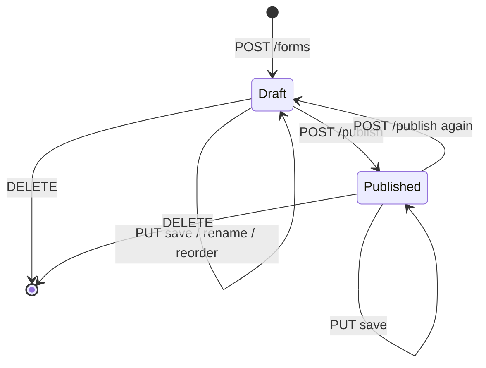
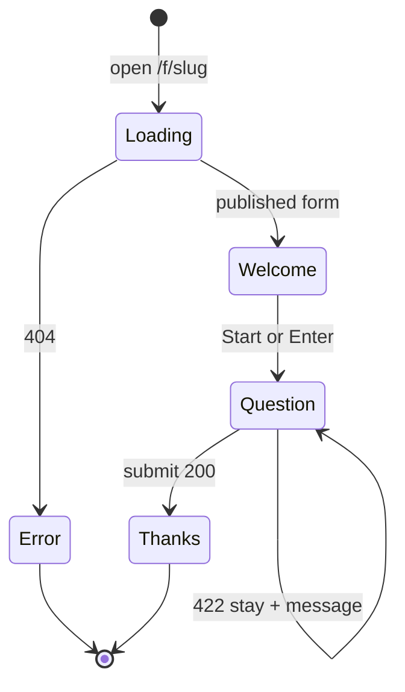
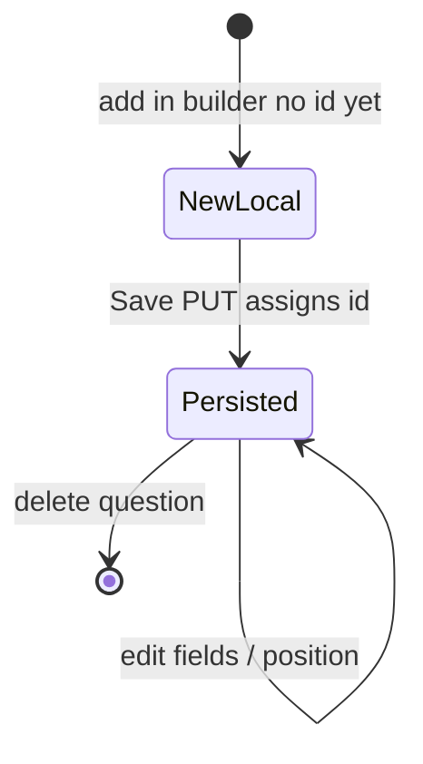
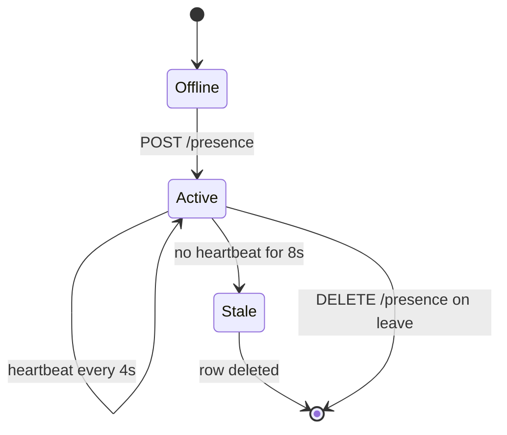
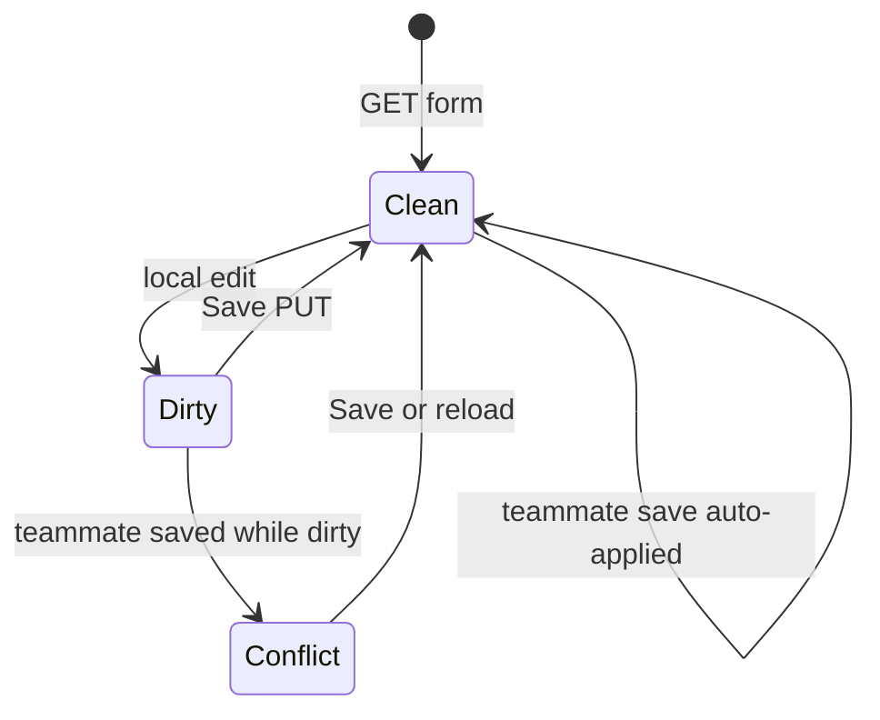

# State machine diagrams

## Form lifecycle

Published is the only state where `GET /api/public/{slug}` succeeds.

## Respondent session

`useRespondent` step enum: `loading | error | welcome | question | thanks`.

## Question row while editing

Logic jump targets only include questions that already have an `id` (saved once).

## Editor presence

## Builder local draft vs remote

