# Use case diagram

Actors: **Owner** (first register — full access, including changing roles), **Editor** (edit/save/publish forms; cannot invite or change roles), **Viewer** (read-only workspace), and **Respondent** (anonymous, shareable link).

```mermaid
flowchart TB
  subgraph Actors
    C((Owner))
    T((Teammate))
    R((Respondent))
  end

  subgraph Workspace
    UC1[Create form]
    UC18[Create from template]
    UC2[Rename / duplicate / delete form]
    UC3[Build questions drag opens gap]
    UC4[Configure theme thank-you webhook]
    UC21[Edit form description textarea]
    UC5[Publish / unpublish]
    UC6[Copy share link]
    UC7[View results insights and table]
    UC8[Export CSV]
    UC9[Invite by email]
    UC19[Copy invite link]
    UC17[Accept invite / sign in]
    UC24[Reviewer demo login]
    UC22[Forgot / reset password]
    UC23[Update name or password]
    UC14[See who is editing]
    UC20[Leave builder clears presence]
    UC15[See who last saved]
    UC16[View activity history]
  end

  subgraph PublicFill
    UC10[Open published form]
    UC11[Answer one question at a time]
    UC12[Validate client and server]
    UC13[Submit and see thank-you]
  end

  C --> UC1
  C --> UC18
  C --> UC2
  C --> UC3
  C --> UC4
  C --> UC21
  C --> UC5
  C --> UC6
  C --> UC7
  C --> UC8
  C --> UC9
  C --> UC19
  C --> UC17
  C --> UC24
  C --> UC22
  C --> UC23
  C --> UC14
  C --> UC20
  C --> UC15
  C --> UC16
  T --> UC1
  T --> UC18
  T --> UC2
  T --> UC3
  T --> UC4
  T --> UC21
  T --> UC5
  T --> UC6
  T --> UC7
  T --> UC8
  T --> UC17
  T --> UC24
  T --> UC22
  T --> UC23
  T --> UC14
  T --> UC20
  T --> UC15
  T --> UC16
  R --> UC10
  R --> UC11
  UC11 --> UC12
  UC12 --> UC13
  UC5 -.->|generates slug /f/slug| UC10
```

### Use case notes

| ID | Actor | Precondition | Postcondition |
|---|---|---|---|
| Create form | Owner / editor | Signed in | Draft form with one question, builder opens |
| Create from template | Owner / editor | Templates tab | Draft form seeded from one of 6 starter kits |
| Build questions | Owner / editor | Form loaded | Ordered questions persisted on Save; drag-over slides neighbors to open a gap, drop commits, Escape cancels; `updated_by` set |
| Form description | Owner / editor | Builder Settings | Description textarea saved; shown on welcome + workspace cards |
| Live presence | Anyone in builder | Heartbeat every 4s | Others see teammate editing (not yourself). Not OT/CRDT. |
| Leave builder | Anyone in builder | Presence row exists | `DELETE /presence` on unmount — others stop seeing you |
| Activity history | Any member | Form exists | Builder Settings shows saved / renamed / published log |
| Publish | Owner / editor | Form has ≥1 question | `status=published`, public GET works |
| Results | Owner / editor / viewer | Form exists | Insight cards (bar / yes-no segment / rating charts) + wrapping table with sticky Submitted column + detail modal; CSV download |
| Fill | Respondent | Form published | Response + answers stored; partial cleared. No login. No powered-by footer. |
| Invite | Owner only | Signed-in owner | Pending invite + email attempt; copy link always available; no member yet |
| Accept invite | Invitee | Valid token | Account + member created as editor (can edit) or viewer (read-only) |
| Change member role | Owner only | Member is editor or viewer | Role becomes the other; viewer cannot mutate forms until made editor |
| Reviewer demo login | Grader | `/login` | Seeded `reviewer@formly.dev` / `FormlyReview1` (editor: can edit forms, cannot invite/remove; not owner, not Gmail); fill button + sign in |
| Forgot password | Anyone with an account | `/forgot-password` | Reset token created (1h); email best-effort; local copy link |
| Workspace Settings | Any member | `/settings` | Account / Password / Team panels via right-side buttons; owner also invites, removes, and changes roles |
