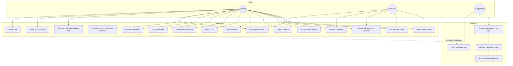

# Use case diagram

Actors: **Creator / teammate** (workspace member) and **Respondent** (anonymous, shareable link).

### Use case notes

| ID | Actor | Precondition | Postcondition |
|---|---|---|---|
| Create form | Creator | Workspace open | Draft form with one question, builder opens |
| Create from template | Creator | Templates tab | Draft form seeded from a starter kit |
| Build questions | Creator / teammate | Form loaded | Ordered questions persisted on Save; `updated_by` set |
| Live presence | Anyone in builder | Heartbeat every 4s | Others see “X editing” (not yourself). Not live typing. |
| Leave builder | Anyone in builder | Presence row exists | `DELETE /presence` — others stop seeing you |
| Activity history | Creator / teammate | Form exists | Settings shows saved / renamed / published log |
| Publish | Creator | Form has ≥1 question | `status=published`, public GET works |
| Fill | Respondent | Form published | Response + answers stored; partial cleared. No login. |
| Invite | Creator | Signed-in owner/editor | Pending invite + email attempt; copy link always available; no member yet |
| Accept invite | Invitee | Valid token | Account + member created; JWT issued |
